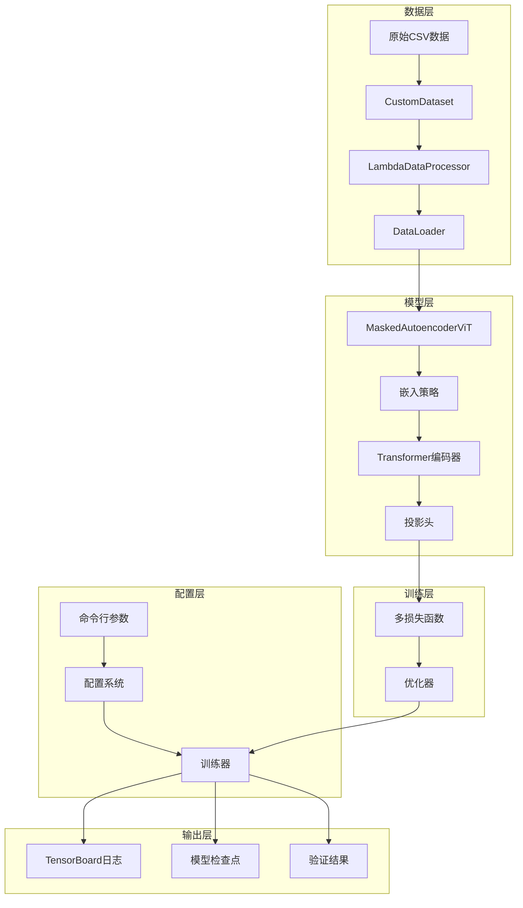
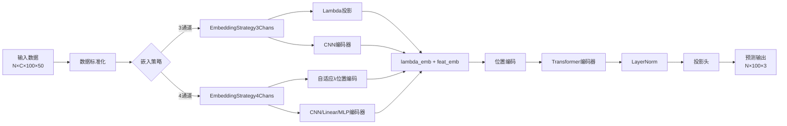
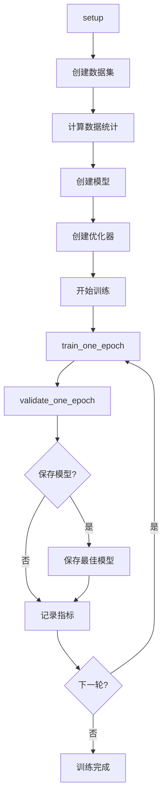
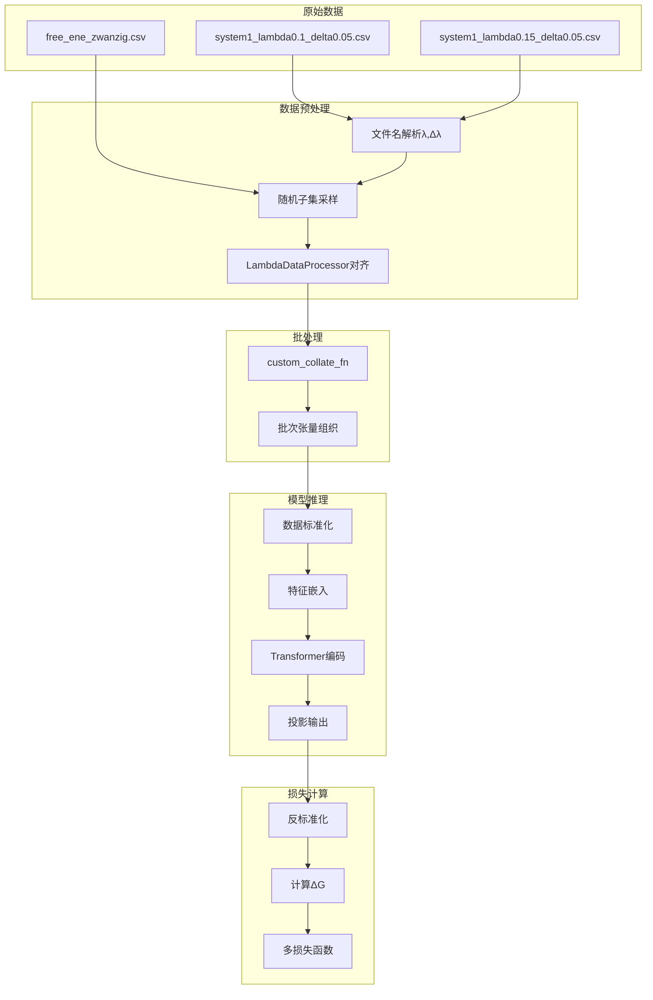

# 分子动力学自由能计算项目 - 代码导读指南

> 🧭 **项目导读** - 深入理解代码架构、数据流和核心算法

## 📖 阅读指南

如果你是第一次接触这个项目，建议按以下顺序阅读代码：

### 🔰 初学者路径
1. **配置系统** (`config.py`) - 了解项目参数管理
2. **主脚本** (`main_train.py`) - 理解项目入口和流程
3. **数据处理** (`util/test_lambda_emb_dataset.py`) - 理解数据格式和预处理
4. **模型定义** (`models/encoder_cnn_model.py`) - 理解核心算法

### 🔬 研究者路径
1. **损失函数** (`util/enc_model_dg_loss.py`) - 理解物理约束
2. **训练引擎** (`util/enc_engine_*.py`) - 理解训练策略
3. **模型细节** (`models/encoder_cnn_model.py`) - 深入算法实现
4. **训练器** (`trainer.py`) - 理解完整训练流程

### 🔧 工程师路径
1. **架构设计** (本文档) - 了解整体设计思路
2. **配置系统** (`config.py`) - 理解参数管理
3. **训练器** (`trainer.py`) - 理解工程实现
4. **模块交互** (各模块) - 理解接口设计

---

## 🏗️ 项目架构总览

### 核心设计理念

```
🎯 目标：使用深度学习预测分子系统的自由能变化(ΔG)
📊 数据：λ窗口采样的分子动力学时间序列
🧠 模型：基于Transformer的自编码器架构
🔬 物理：结合分子动力学知识的损失函数设计
```

### 架构图



---

## 📂 模块详细解析

### 1. 配置管理系统 (`config.py`)

#### 🎯 核心职责
统一管理项目的所有配置参数，提供类型安全的配置访问。

#### 🔑 关键组件

```python
@dataclass
class Config:
    data: DataConfig      # 数据相关配置
    model: ModelConfig    # 模型相关配置  
    training: TrainingConfig  # 训练相关配置
    output: OutputConfig  # 输出相关配置
```

#### 🌟 设计亮点
- **类型安全**: 使用dataclass提供自动类型检查
- **智能计算**: 自动计算有效批次大小对应的学习率
- **验证机制**: 配置有效性检查和设备可用性检测
- **灵活创建**: 支持从命令行参数或代码直接创建

#### 💡 使用示例
```python
# 从命令行创建配置
config = Config.from_args(args)
config.validate()
config.print_config()

# 访问配置
batch_size = config.training.batch_size
model_name = config.model.model_name
```

---

### 2. 数据处理模块 (`util/test_lambda_emb_dataset.py`)

#### 🎯 核心职责
处理分子动力学原始数据，转换为深度学习模型可用的格式。

#### 🔑 关键组件

##### `LambdaDataProcessor` 类
**功能**: 数据标准化和对齐
```python
原始数据: 可变长度λ窗口 → 标准化: 100窗口固定网格
输入: [N个样本, 每样本M个窗口, 每窗口K个数据点]
输出: [N, C, 100, max_data] 张量 + 掩码信息
```

**关键特性**:
- **窗口对齐**: 将不同λ值的窗口映射到标准0.01间隔网格
- **长度统一**: 填充或截断到固定长度
- **掩码生成**: 记录有效窗口和原始数据长度
- **多通道支持**: 灵活处理3通道或4通道数据

##### `CustomDataset` 类
**功能**: 数据集加载和管理
```python
文件结构: system_X/complex|ligand/*.csv + fe_cal_out/free_ene_zwanzig.csv
解析规则: *_lambda{λ值}_delta{δλ值}.csv
```

**关键特性**:
- **智能解析**: 自动从文件名提取λ和Δλ值
- **随机采样**: 每个系统生成多个随机子集进行数据增强
- **目标加载**: 从free_ene.csv加载真实ΔG值
- **批处理**: 通过custom_collate_fn处理可变长度数据

#### 🌊 数据流向
```
1. CSV文件读取 → pandas DataFrame
2. 文件名解析 → λ, Δλ 参数提取
3. 随机子集采样 → 数据增强
4. LambdaDataProcessor → 标准化对齐
5. DataLoader + collate_fn → 批次组织
```

#### 💡 数据格式示例
```python
# 输入数据
processed_data_dict = {
    'data': torch.Tensor,           # [N, C, 100, 50] 标准化数据
    'lambdas': torch.Tensor,        # [N, 100] λ值
    'deltas': torch.Tensor,         # [N, 100] Δλ值  
    'masks': {
        'window': torch.Tensor,     # [N, 100] 有效窗口掩码
        'delta': torch.Tensor       # [N, 100] 真实Δλ掩码
    },
    'original_lengths': torch.Tensor # [N, 100] 原始数据长度
}
```

---

### 3. 模型定义模块 (`models/encoder_cnn_model.py`)

#### 🎯 核心职责
实现基于Transformer的自由能预测模型，结合物理知识和深度学习。

#### 🧩 模型架构



#### 🔑 关键组件

##### `AdaptiveLambdaEncoding` 类
**创新点**: 可学习的λ位置编码
```python
# 传统位置编码: 固定频率
PE[pos] = sin(pos/10000^(2i/d))

# 自适应λ编码: 可学习频率
PE[λ] = sin(λ*C/10000^(2i/d))  # C是可学习参数
```

**物理意义**: 
- λ值在[0,1]范围内，需要特殊的编码策略
- 可学习的C因子让模型自适应λ值分布特性

##### 嵌入策略系统
**设计模式**: 策略模式，根据输入通道数选择嵌入方式

**3通道策略** (`EmbeddingStrategy3Chans`):
```python
输入: μ, σ², error (分子动力学基础量)
λ特征: [λ, Δλ, window_mask] → Linear投影
数据特征: [μ, σ², error] → CNN编码
输出: lambda_emb + feat_emb
```

**4通道策略** (`EmbeddingStrategy4Chans`):
```python
输入: μ, σ², error, Δλ (包含Δλ通道)
λ编码: AdaptiveLambdaEncoding(λ值)
数据编码: CNN/Linear/MLP三种选择
输出: lambda_emb + feat_emb
```

##### `MaskedAutoencoderViT` 主模型
**核心流程**:
1. **数据标准化**: 使用训练集统计信息Z-score标准化
2. **特征嵌入**: 根据通道数选择嵌入策略
3. **Transformer编码**: 多头注意力学习窗口间关系
4. **特征投影**: 输出μ、σ、error三个物理量

#### 🎯 多损失函数系统

##### 1. 总ΔG损失 (Total ΔG Loss)
```python
# 物理公式: dG = μ - σ²/2 + error (每窗口)
# 总ΔG = Σ(dG_i * mask_i) * kbt
pred_total_dg = (pred_dg_per_window * window_mask).sum(dim=1) * 0.592
loss = MSE(pred_total_dg, target_total_dg)
```

##### 2. 聚合ΔG损失 (Aggregation ΔG Loss)
```python
# 处理不同Δλ值的窗口聚合
# 将100个标准窗口聚合回原始窗口数量
聚合比例 = 原始Δλ / 0.01
聚合损失 = dg_aggregation_loss_v2(预测, 原始窗口信息)
```

##### 3. 平滑损失 (Smoothness Loss)
```python
# 基于二阶导数的平滑约束
second_derivative = f[i+2] - 2*f[i+1] + f[i]
smoothness_loss = mean(second_derivative²)
```

##### 4. 特征损失 (Feature Loss)
```python
# 直接监督μ、σ、error预测
feature_loss = MSE(pred_mu, target_mu) + 
               MSE(pred_sigma, target_sigma) + 
               MSE(pred_error, target_error)
```

---

### 4. 训练器模块 (`trainer.py`)

#### 🎯 核心职责
封装完整的训练流程，提供高层次的训练接口。

#### 🔄 训练流程



#### 🔑 关键特性

##### 动态统计计算
```python
# 训练前动态计算数据集统计信息
for batch in data_loader:
    for channel in [0, 1, 2]:  # μ, σ², error
        valid_data = extract_valid_points(batch, channel)
        accumulate_statistics(valid_data)

train_means = sum_features / total_points
train_stds = sqrt(sum_squares/total_points - means²)
```

##### 分布式训练支持
```python
# 自动检测并配置分布式训练
if world_size > 1:
    sampler = DistributedSampler(dataset)
    model = DistributedDataParallel(model)
else:
    sampler = RandomSampler(dataset)
```

##### 智能检查点管理
```python
# 基于验证损失的最佳模型保存
if val_loss < best_val_loss:
    best_val_loss = val_loss
    save_model(model, optimizer, epoch)
```

---

### 5. 训练引擎模块 (`util/enc_engine_*.py`)

#### 🎯 核心职责
实现具体的训练和验证逻辑。

#### 🔑 关键功能

##### `train_one_epoch` (训练一轮)
```python
# 核心训练循环
for batch in data_loader:
    # 前向传播
    loss_dict = model(processed_data, original_data_lists...)
    
    # 反向传播
    loss = loss_dict['loss'] / accum_iter
    loss_scaler.scale(loss).backward()
    
    # 梯度累积
    if (step + 1) % accum_iter == 0:
        loss_scaler.step(optimizer)
        loss_scaler.update()
        optimizer.zero_grad()
```

##### `validate` (验证过程)
```python
# 验证过程，计算多种指标
metrics = {
    'loss': 平均损失,
    'total_dg_mae': 总ΔG平均绝对误差,
    'feature_mae': 特征平均绝对误差,
    'predictions': 预测结果
}

# 保存详细验证结果
save_validation_results(predictions, targets, 'validation_results.csv')
save_per_window_results(window_predictions, 'per_window_results.csv')
```

---

### 6. 损失计算模块 (`util/enc_model_dg_loss.py`)

#### 🎯 核心职责
实现复杂的ΔG聚合损失计算。

#### 🔑 关键算法

##### `dg_aggregation_loss_v2`
**问题**: 模型预测100个标准窗口，但原始数据有不同数量和大小的窗口
**解决**: 智能聚合算法

```python
# 聚合算法核心逻辑
for 原始窗口 in 原始窗口列表:
    聚合比例 = 原始窗口.Δλ / 0.01
    起始索引 = round(原始窗口.λ / 0.01)
    结束索引 = 起始索引 + 聚合比例
    
    聚合预测ΔG = sum(pred_dg[起始:结束]) * kbt
    loss += (聚合预测ΔG - 原始ΔG)²
```

**物理意义**:
- 保持能量守恒
- 处理不同分辨率的窗口
- 单位转换 (无量纲 → kcal/mol)

---

## 🌊 完整数据流分析

### 数据流向图



### 关键数据变换

#### 1. 文件 → 数据集
```python
# 输入: CSV文件
"system1_lambda0.1_delta0.05.csv" → 
{
    'data': [μ时间序列, σ²时间序列, error时间序列],
    'lambda': 0.1,
    'delta': 0.05,
    'length': 实际数据点数
}
```

#### 2. 数据集 → 标准网格
```python
# LambdaDataProcessor处理
可变长度窗口 → 100窗口标准网格
data: [N_samples, variable_windows, variable_length, 3] → 
      [N, 3, 100, 50] + masks + lengths
```

#### 3. 模型输入 → 输出
```python
# 模型推理
输入: [N, C, 100, 50] (标准化后)
↓ 嵌入策略
[N, 100, embed_dim] (lambda_emb + feat_emb)
↓ Transformer
[N, 100, embed_dim] (编码特征)
↓ 投影头
输出: [N, 100, 3] (μ, σ, error预测)
```

#### 4. 预测 → 损失
```python
# 损失计算
预测: [N, 100, 3] → 反标准化 → [N, 100, 3]
↓ 计算ΔG
每窗口ΔG: [N, 100] = μ - σ²/2 + error
↓ 多损失函数
总损失 = w1*总ΔG损失 + w2*聚合损失 + w3*平滑损失 + w4*特征损失
```

---

## 🔬 核心算法深度解析

### 1. 自适应λ位置编码算法

#### 传统位置编码问题
- 标准Transformer位置编码针对自然语言序列位置
- λ值是物理量，范围[0,1]，需要特殊处理
- 不同λ值之间的"距离"有物理意义

#### 创新解决方案
```python
class AdaptiveLambdaEncoding(nn.Module):
    def __init__(self, d_model, init_C=100.0):
        # C是可学习参数，调节编码频率
        self.C = nn.Parameter(torch.tensor(init_C))
        
    def forward(self, lambda_val):
        # λ值缩放
        lambda_scaled = lambda_val * self.C
        
        # 正弦余弦编码
        pe[..., 0::2] = sin(lambda_scaled * div_term)
        pe[..., 1::2] = cos(lambda_scaled * div_term)
        
        return pe
```

#### 物理意义
- **C因子学习**: 模型自动学习最适合λ值分布的编码频率
- **连续性保证**: λ值相近的窗口获得相似的编码
- **可区分性**: 不同λ值获得充分区分的编码

### 2. 多损失函数协同优化

#### 损失函数设计理念
```python
# 物理约束 + 数据拟合 + 平滑约束
总损失 = 物理一致性损失 + 数据重建损失 + 正则化损失
```

#### 具体实现
```python
def forward_loss(self, pred, targets):
    loss_dict = {}
    total_loss = 0
    
    # 1. 物理一致性 - 总ΔG损失
    if self.total_dg_loss_weight > 0:
        pred_total_dg = compute_total_dg(pred)
        target_total_dg = get_target_total_dg(targets)
        total_dg_loss = F.mse_loss(pred_total_dg, target_total_dg)
        total_loss += self.total_dg_loss_weight * total_dg_loss
    
    # 2. 尺度一致性 - 聚合损失  
    if self.agg_dg_loss_weight > 0:
        agg_loss = dg_aggregation_loss_v2(pred, original_windows)
        total_loss += self.agg_dg_loss_weight * agg_loss
    
    # 3. 物理合理性 - 平滑损失
    if self.smoothness_loss_weight > 0:
        smoothness_loss = compute_smoothness_loss(pred)
        total_loss += self.smoothness_loss_weight * smoothness_loss
    
    # 4. 数据拟合 - 特征损失
    if self.feature_loss_weight > 0:
        feature_loss = compute_feature_loss(pred, targets)
        total_loss += self.feature_loss_weight * feature_loss
    
    return {'loss': total_loss, **loss_dict}
```

### 3. 窗口聚合算法

#### 问题描述
- **模型输出**: 100个标准0.01间隔窗口的ΔG预测
- **真实数据**: 任意数量、任意Δλ大小的窗口
- **目标**: 将标准窗口聚合到原始窗口进行比较

#### 聚合算法
```python
def dg_aggregation_loss_v2(pred_dg_per_window, window_mask, 
                          original_lambdas, original_deltas, original_dGs):
    """
    智能窗口聚合算法
    """
    loss = 0
    for sample_idx in range(batch_size):
        sample_pred = pred_dg_per_window[sample_idx]  # [100]
        sample_mask = window_mask[sample_idx]         # [100]
        
        for orig_window_idx, (lambda_val, delta_val, target_dg) in enumerate(
            zip(original_lambdas[sample_idx], 
                original_deltas[sample_idx], 
                original_dGs[sample_idx])):
            
            # 计算聚合范围
            start_idx = round(lambda_val / 0.01)
            aggregation_ratio = delta_val / 0.01
            end_idx = start_idx + aggregation_ratio
            
            # 聚合预测ΔG
            if end_idx <= 100:
                mask_slice = sample_mask[start_idx:end_idx]
                pred_slice = sample_pred[start_idx:end_idx]
                
                if mask_slice.sum() > 0:
                    # 加权聚合 + 单位转换
                    aggregated_pred_dg = (pred_slice * mask_slice).sum() * kbt
                    target_dg_with_unit = target_dg * kbt
                    
                    # 累积损失
                    loss += (aggregated_pred_dg - target_dg_with_unit) ** 2
    
    return loss / batch_size
```

#### 算法创新点
- **尺度适应**: 自动处理不同Δλ大小的窗口
- **掩码保护**: 只聚合有效窗口，避免填充数据干扰
- **单位统一**: 自动进行kbt单位转换
- **能量守恒**: 保证聚合过程的物理一致性

---

## 🚀 运行指南

### 快速开始
```bash
# 基础训练
python main_train.py \
    --data_path /path/to/data \
    --epochs 100 \
    --batch_size 4

# 完整配置训练
python main_train.py \
    --data_path /path/to/data \
    --output_dir ./outputs \
    --batch_size 4 \
    --epochs 100 \
    --model enc_cnn_chans3 \
    --total_dg_loss_weight 1.0 \
    --agg_dg_loss_weight 1.0 \
    --smoothness_loss_weight 0.1 \
    --feature_loss_weight 1.0
```

### 数据格式要求
```
data_path/
├── train/
│   └── system_X/
│       ├── complex/
│       │   ├── data_lambda0.05_delta0.01.csv    # μ,σ²,error时间序列
│       │   ├── data_lambda0.06_delta0.01.csv
│       │   └── fe_cal_out/
│       │       └── free_ene_zwanzig.csv         # 目标ΔG值
│       └── ligand/
│           └── (相同结构)
└── val/
    └── (相同结构)
```

### 模型选择指南

#### 3通道模型 (enc_cnn_chans3)
- **适用**: 基础分子动力学数据
- **输入**: μ, σ², error
- **特点**: Lambda投影 + CNN编码
- **推荐**: 标准自由能计算任务

#### 4通道模型 (enc_cnn_chans4)  
- **适用**: 包含Δλ信息的数据
- **输入**: μ, σ², error, Δλ
- **特点**: 自适应λ编码 + 多种编码方式
- **推荐**: 复杂窗口结构数据

---

## 🔍 调试和故障排除

### 常见问题

#### 1. 内存不足
**症状**: CUDA out of memory
**解决**: 
- 减少`batch_size`
- 减少`per_lambda_max_points`
- 检查`num_random_subsets_per_system`

#### 2. 收敛困难
**症状**: 损失不下降或震荡
**解决**:
- 调整损失权重平衡
- 降低学习率
- 增加warmup轮数
- 检查数据标准化

#### 3. 数据格式错误
**症状**: 数据加载失败
**解决**:
- 检查CSV文件格式
- 验证文件名λ,Δλ解析
- 确认free_ene.csv存在

### 调试技巧

#### 启用详细日志
```python
# 在trainer.py中添加
import logging
logging.basicConfig(level=logging.DEBUG)
```

#### 可视化数据流
```python
# 在模型中添加中间输出
def forward_encoder(self, ...):
    x = self.embedding_module(...)
    print(f"嵌入输出形状: {x.shape}")
    
    x = x + self.pos_embed
    print(f"位置编码后形状: {x.shape}")
    
    for i, blk in enumerate(self.blocks):
        x = blk(x)
        if i < 3:  # 只打印前几层
            print(f"第{i}层Transformer输出: {x.shape}")
```

#### 损失分析
```python
# 监控各损失分量
def forward_loss(self, ...):
    loss_dict = {...}
    
    # 打印损失权重和数值
    for key, value in loss_dict.items():
        if 'loss' in key:
            print(f"{key}: {value.item():.6f}")
    
    return loss_dict
```

---

## 📈 性能优化建议

### 训练加速
1. **混合精度训练**: 使用AMP自动混合精度
2. **梯度累积**: 增加有效批次大小
3. **数据预取**: 增加`num_workers`
4. **内存固定**: 启用`pin_memory`

### 内存优化
1. **批次大小**: 根据GPU内存调整
2. **数据点采样**: 限制`per_lambda_max_points`
3. **子集数量**: 调整`num_random_subsets_per_system`
4. **检查点**: 定期清理中间结果

### 模型优化
1. **嵌入维度**: 根据数据复杂度调整`embed_dim`
2. **Transformer层数**: 平衡深度和计算成本
3. **损失权重**: 根据任务重要性调整权重

---

## 🔬 扩展指南

### 添加新的嵌入策略
```python
class MyEmbeddingStrategy(BaseEmbeddingModule):
    def __init__(self, embed_dim, img_size, in_chans, **kwargs):
        super().__init__()
        self.my_encoder = create_my_encoder(...)
    
    def forward(self, x, lambdas, deltas, masks, original_lengths):
        # 实现你的嵌入逻辑
        lambda_emb = self.lambda_encoding(lambdas)
        feat_emb = self.my_encoder(x)
        return lambda_emb, feat_emb

# 在MaskedAutoencoderViT中注册
if in_chans == 5:  # 新的通道数
    self.embedding_module = MyEmbeddingStrategy(...)
```

### 添加新的损失函数
```python
def forward_loss(self, pred, ...):
    # 现有损失计算...
    
    # 添加新损失
    if self.my_loss_weight > 0:
        my_loss = self.compute_my_loss(pred, targets)
        loss_dict['my_loss'] = my_loss
        total_loss += self.my_loss_weight * my_loss
    
    return loss_dict

def compute_my_loss(self, pred, targets):
    # 实现你的损失逻辑
    return loss_value
```

### 自定义数据预处理
```python
class MyDataProcessor(LambdaDataProcessor):
    def process(self, original_data, ...):
        # 调用父类方法
        result = super().process(original_data, ...)
        
        # 添加你的处理逻辑
        result['my_feature'] = self.compute_my_feature(original_data)
        
        return result
```

---

## 📚 参考资料

### 核心论文
- **MAE**: "Masked Autoencoders Are Scalable Vision Learners"
- **Vision Transformer**: "An Image is Worth 16x16 Words"
- **自由能计算**: 分子动力学相关论文

### 技术文档
- **PyTorch官方文档**: https://pytorch.org/docs/
- **timm库文档**: https://timm.fast.ai/
- **TensorBoard使用指南**: https://www.tensorflow.org/tensorboard

### 代码风格
- **PEP 8**: Python代码风格指南
- **Google Python Style**: 详细的Python编程规范
- **Type Hints**: Python类型提示最佳实践

---

## 🤝 贡献指南

### 代码贡献流程
1. Fork项目到你的GitHub
2. 创建特性分支: `git checkout -b feature/amazing-feature`
3. 编写代码并确保通过测试
4. 提交更改: `git commit -m 'Add amazing feature'`
5. 推送分支: `git push origin feature/amazing-feature`
6. 创建Pull Request

### 代码质量要求
- **代码风格**: 遵循PEP 8规范
- **类型提示**: 为所有函数添加类型提示
- **文档字符串**: 详细的中文docstring
- **单元测试**: 为新功能添加测试
- **性能测试**: 确保不降低训练性能

### 提交信息格式
```
🚀 feat: 添加新的嵌入策略

- 实现MyEmbeddingStrategy类
- 支持5通道输入数据
- 添加相应的配置选项
- 更新文档和测试

Closes #123
```

---

> 💡 **总结**: 这个项目展现了优秀的软件工程实践，将复杂的分子动力学问题转化为深度学习问题，并通过创新的模型设计和损失函数来解决特定领域的挑战。代码结构清晰，模块化程度高，为科研和工程实践提供了优秀的范例。

---

📅 **最后更新**: 2024年6月  
📧 **技术支持**: 通过GitHub Issues提出问题  
🌟 **项目地址**: https://github.com/phloglucinol/enc-cnn-refactored